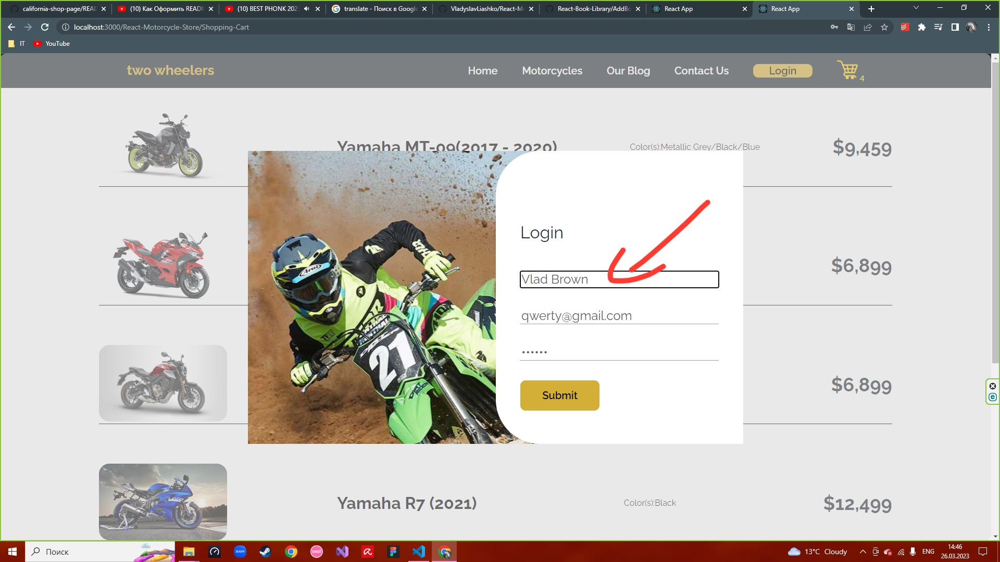

<h1> Motorcycle Store</h1>
<h2> About </h2> 

 In this project, I made a website for the sale of motorcycles. There is no hardcode in this project, I took all the data and text from the json file (imitation of a response from the server) and passed them through props 

<h2> Technologies </h2>
<ul>
  <li> HTML5</li>
  <li> CSS3</li>
  <li> SCSS</li>
  <li> Java Script</li>
  <li> React</li>
  <li> Redux</li>
  <li> React Router</li>
</ul>

<h2>Features</h2>

<h3> <b>Login modal page </b> </h3>

The user can log in by clicking on the "login" button, after thatwill pop up a modal window , where you can enter his data and after he clicks the "submit" button they will be saved, after that user will see the text "now you are logged in"

 
<h3> <b>Blog page</b> </h3>

The user can write comments on the "Our Blog" page, if the user is logged in before these, he will write comments on his own name 

 
<h3> <b>Motorcycles Page </b> </h3>

If you click on the "Motorcycles" page, you will be redirected to the page where the entire range of products is located 

 
<h3> <b>Search</b> </h3>

If the user wants to search for a specific motorcycle, he just needs to enter the first letters of the name of the motorcycle, and he will be given all the motorcycles that have such letters in the name 

 
<h3> <b>More info about motorcycle</b> </h3>

The user can click on the motorcycle he is interested in and see detailed information about it (this was done using react-router)

 
<h3> <b>Add motorcycle to shopping cart</b> </h3>

The user can add a motorcycle to the shopping cart by clicking on the "add to shopping cart" button, after that the number of products near the cart icon will change and the product will be added to the cart (this was done using Redux)

 
<h3> <b>Shopping cart</b> </h3>

The user can view his cart of goods by clicking on the yellow cart icon, inside will be all the goods that he added  
P.S. after reloading the page, the selected motorcycles will not be saved

